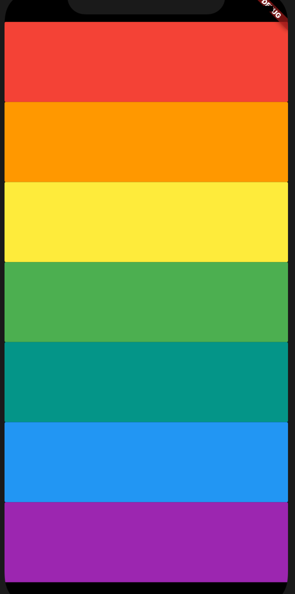

# Xylophone 🎹

## Goal

In this project I dived into more Dart programming concepts such as lists, loops, functions and much much more.

## Description

Made a music app that plays Xylophone sounds. 

## Things learnt

- How to incorporate open source libraries of code into your project using Flutter Packages.
- How to play sound on both iOS and Android.
- How to generate repeated user interface Widgets.
- How to use Dart functions that can take input arguments as well as return an output.
- What is the difference between var, const and final in Dart.
- How to use Dart lists.
- How to loop through code using a Dart for loop.

